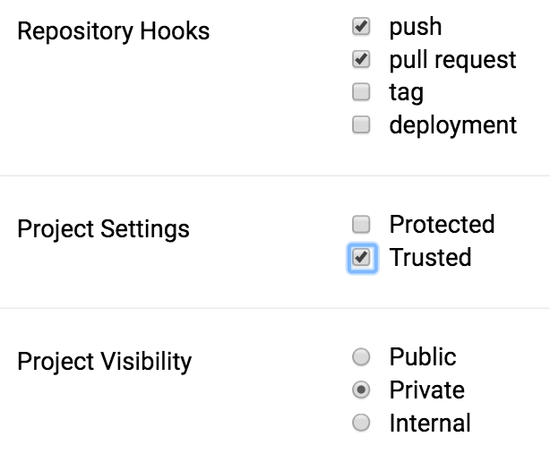

# drone-ssh

[](https://github.com/appleboy/drone-ssh/releases) [](https://godoc.org/github.com/appleboy/drone-ssh) [](http://drone.wu-boy.com/appleboy/drone-ssh) [](https://codecov.io/gh/appleboy/drone-ssh) [](https://goreportcard.com/report/github.com/appleboy/drone-ssh) [](https://hub.docker.com/r/appleboy/drone-ssh/) [](https://microbadger.com/images/appleboy/drone-ssh "Get your own image badge on microbadger.com")

Drone plugin to execute commands on a remote host through SSH. For the usage
information and a listing of the available options please take a look at [the docs](http://plugins.drone.io/appleboy/drone-ssh/).

**Note: Please update your image config path to `appleboy/drone-ssh` for drone. `plugins/ssh` is no longer maintained.**


## Build

Build the binary with the following commands:

```
go build
go test
```

## Docker

Build the docker image with the following commands:

```
docker build -t appleboy/drone-ssh .
```

## Usage

Execute from the working directory:

```sh
docker run --rm \
  -e PLUGIN_HOST=foo.com \
  -e PLUGIN_USERNAME=root \
  -e PLUGIN_KEY="$(cat ${HOME}/.ssh/id_rsa)" \
  -e PLUGIN_SCRIPT=whoami \
  -v $(pwd):$(pwd) \
  -w $(pwd) \
  appleboy/drone-ssh
```

## Mount key from file path

Please make sure that enable the `trusted` mode in project setting.



Mount private key in `volumes` setting of `.drone.yml` config

```diff
pipeline:
  ssh:
    image: appleboy/drone-ssh
    host: xxxxx.com
    username: deploy
+   volumes:
+     - /root/drone_rsa:/root/ssh/drone_rsa
    key_path: /root/ssh/drone_rsa
    script:
      - echo "test ssh"
```

See the detail of [issue comment](https://github.com/appleboy/drone-ssh/issues/51#issuecomment-336732928).
