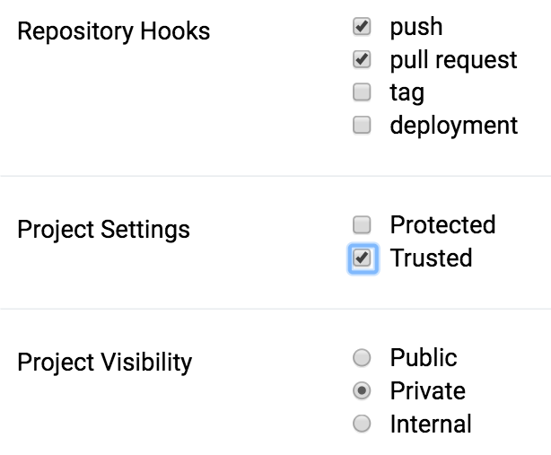

# drone-ssh

> [English](./README.md) | [繁體中文](./README.zh-tw.md) | **简体中文**


<!-- 图片说明：SSH 日志画面，内容与原文一致 -->

[](https://github.com/appleboy/drone-ssh/releases)
[](https://godoc.org/github.com/appleboy/drone-ssh)
[](https://github.com/appleboy/drone-ssh/actions/workflows/testing.yml)
[](https://github.com/appleboy/drone-ssh/actions/workflows/trivy.yml)
[](https://codecov.io/gh/appleboy/drone-ssh)
[](https://goreportcard.com/report/github.com/appleboy/drone-ssh)
[](https://hub.docker.com/r/appleboy/drone-ssh/)

Drone 插件，可通过 SSH 在远程主机执行命令。使用方法和可用选项请参考[官方文档](http://plugins.drone.io/appleboy/drone-ssh/)。

**注意：请将 Drone 的 image config 路径更新为 `appleboy/drone-ssh`。`plugins/ssh` 已不再维护。**


<!-- 图片说明：SSH 命令执行演示动画，内容与原文一致 -->

## 目录

- [drone-ssh](#drone-ssh)
  - [目录](#目录)
  - [重大变更](#重大变更)
  - [构建或下载二进制文件](#构建或下载二进制文件)
  - [Docker](#docker)
  - [使用方法](#使用方法)
  - [通过文件路径挂载密钥](#通过文件路径挂载密钥)
  - [配置说明](#配置说明)

## 重大变更

`v1.5.0`：将命令超时参数更改为 `Duration` 格式。设置示例如下：

```diff
pipeline:
  scp:
    image: ghcr.io/appleboy/drone-ssh
    settings:
      host:
        - example1.com
        - example2.com
      username: ubuntu
      password:
        from_secret: ssh_password
      port: 22
-     command_timeout: 120
+     command_timeout: 2m
      script:
        - echo "Hello World"
```

## 构建或下载二进制文件

可在[发布页面](https://github.com/appleboy/drone-ssh/releases)下载预编译的二进制文件，支持以下操作系统：

- Windows amd64/386
- Linux arm/amd64/386
- macOS (Darwin) amd64/386

如已安装 `Go`，可执行：

```sh
go install github.com/appleboy/drone-ssh@latest
```

或使用以下命令手动构建二进制文件：

```sh
export GOOS=linux
export GOARCH=amd64
export CGO_ENABLED=0
export GO111MODULE=on

go test -cover ./...

go build -v -a -tags netgo -o release/linux/amd64/drone-ssh .
```

## Docker

可使用以下命令构建 Docker 镜像：

```sh
make docker
```

## 使用方法

在工作目录下执行：

```sh
docker run --rm \
  -e PLUGIN_HOST=foo.com \
  -e PLUGIN_USERNAME=root \
  -e PLUGIN_KEY="$(cat ${HOME}/.ssh/id_rsa)" \
  -e PLUGIN_SCRIPT=whoami \
  -v $(pwd):$(pwd) \
  -w $(pwd) \
  ghcr.io/appleboy/drone-ssh
```

## 通过文件路径挂载密钥

请确保已在项目设置中启用 `trusted` 模式（适用于 [Drone 0.8 版本](https://0-8-0.docs.drone.io/)）。



在 `.drone.yml` 配置文件的 `volumes` 部分挂载私钥：

```diff
pipeline:
  ssh:
    image: ghcr.io/appleboy/drone-ssh
    host: xxxxx.com
    username: deploy
+   volumes:
+     - /root/drone_rsa:/root/ssh/drone_rsa
    key_path: /root/ssh/drone_rsa
    script:
      - echo "test ssh"
```

详情请参考 [此 issue comment](https://github.com/appleboy/drone-ssh/issues/51#issuecomment-336732928)。

## 配置说明

更多示例和完整配置选项请参考 [DOCS.md](./DOCS.md)。

配置选项来源如下：

0. 内置 drone-ssh 默认值。详见 [main.go CLI Flags](https://github.com/appleboy/drone-ssh/blob/6d9d6acc6aef1f9166118c6ba8bd214d3a582bdb/main.go#L39)。
1. 由 `PLUGIN_ENV_FILE` 环境变量指定的 dotenv 文件。
2. `.drone.yml` Drone 配置文件。

后面的来源会覆盖前面的设置。例如，`.env` 文件中的 `PORT` 会覆盖 main.go 的默认值。
